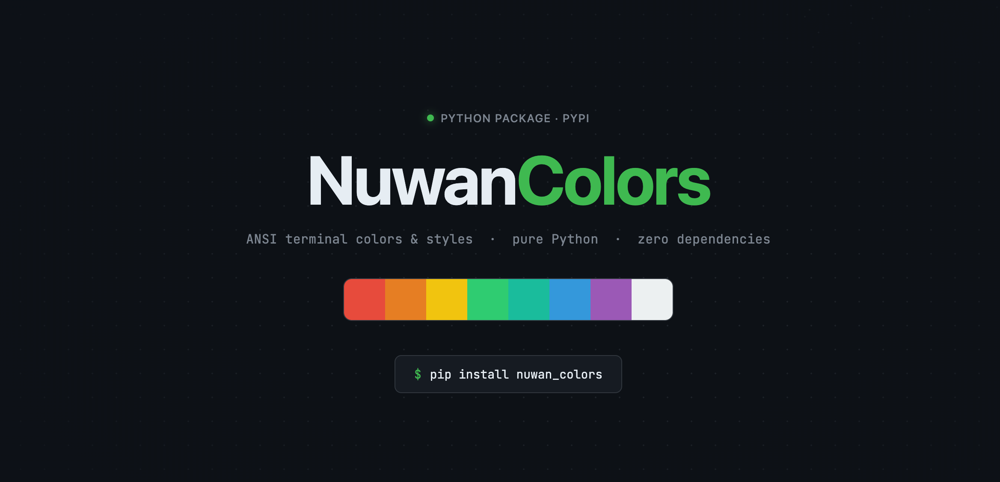

# 🎨 NuwanColors

A lightweight Python package by **Shashika Nuwan (DevNuwancat)** for adding customizable text coloring and styling to terminal output — making console applications more visually appealing and readable.




---

## 🚀 Installation

```bash
pip install nuwan_colors
```

Or install directly from GitHub:

```bash
pip install git+https://github.com/DevNuwancat/NuwanColors.git
```

---

## ⚡ Quick Start

```python
from nuwan_colors import Colors, Texts

# Text colors
print(Colors.green("✅ Success!"))
print(Colors.red("❌ Error occurred"))
print(Colors.yellow("⚠️  Warning!"))
print(Colors.blue("🔵 Processing..."))

# Text styles
print(Texts.bold("Bold text"))
print(Texts.italic("Italic text"))
print(Texts.underline("Underlined text"))

# Combine colors + styles
print(Colors.green(Texts.bold("✅ Done!")))
print(Colors.red(Texts.italic("❌ Failed!")))
```

---

## 🎨 Colors Available

### Text Colors
| Method | Output |
|--------|--------|
| `Colors.black(text)` | ⚫ Black |
| `Colors.red(text)` | 🔴 Red |
| `Colors.green(text)` | 🟢 Green |
| `Colors.yellow(text)` | 🟡 Yellow |
| `Colors.blue(text)` | 🔵 Blue |
| `Colors.magneta(text)` | 🟣 Magenta |
| `Colors.cyan(text)` | 🩵 Cyan |
| `Colors.white(text)` | ⚪ White |

### Background Colors
| Method | Output |
|--------|--------|
| `Colors.bg_red(text)` | Red background |
| `Colors.bg_green(text)` | Green background |
| `Colors.bg_yellow(text)` | Yellow background |
| `Colors.bg_blue(text)` | Blue background |
| `Colors.bg_cyan(text)` | Cyan background |
| `Colors.bg_magneta(text)` | Magenta background |
| `Colors.bg_white(text)` | White background |
| `Colors.bg_reverse_white(text)` | Reversed white |

---

## 🖋️ Text Styles Available

| Method | Style |
|--------|-------|
| `Texts.bold(text)` | **Bold** |
| `Texts.italic(text)` | *Italic* |
| `Texts.underline(text)` | Underlined |
| `Texts.blink(text)` | Blinking |
| `Texts.concealed(text)` | Hidden |

---

## ✨ Combining Colors and Styles

Nest Colors and Texts together for maximum effect:

```python
from nuwan_colors import Colors, Texts

# Color + Style combinations
print(Colors.green(Texts.bold("✅ Build passed!")))
print(Colors.red(Texts.italic("❌ Test failed")))
print(Colors.blue(Texts.underline("🔵 Starting agent...")))
print(Colors.bg_red(Texts.bold("🔴 CRITICAL ERROR")))
```

---

## 💡 Recommended Color System

Use consistent colors across your project:

```python
# ✅ SUCCESS → Green
print(Colors.green("Operation completed"))

# ❌ ERROR → Red  
print(Colors.red("Something went wrong"))

# 🔵 INFO → Blue
print(Colors.blue("Starting process..."))

# ⚠️ WARNING → Yellow
print(Colors.yellow("Skipping invalid item"))

# 📊 DATA → Cyan
print(Colors.cyan("Retrieved 30 records"))

# 🔴 CRITICAL → Red Background
print(Colors.bg_red(Texts.bold("CRITICAL FAILURE")))
```

---

## 🧠 How It Works

NuwanColors uses **ANSI escape codes** — special character sequences that terminals understand as color commands. No external dependencies. Pure Python.

```python
# Behind the scenes:
Colors.green("Hello")
# → "\033[32mHello\033[0m"
#     ↑          ↑      ↑
#   start      text   reset
#   green
```

---

## 📦 Package Structure

```
NuwanColors/
├── nuwan_colors/
│   ├── __init__.py    ← exports Colors and Texts
│   └── core.py        ← all color logic
├── test.py            ← test all colors and styles
├── setup.py           ← package config
├── README.md
└── LICENSE.md
```

---

## ⚠️ Limitations

- May not render in old Windows CMD (works in PowerShell & Windows Terminal)
- Colors won't show in plain log files or non-TTY environments

---

## 📄 License

MIT License — free to use in any project, personal or commercial.

---

## 👨‍💻 Author

**Shashika Nuwan** — [DevNuwancat](https://github.com/DevNuwancat)

> 💡 Tip: Combine `Colors` + `Texts` for maximum terminal beauty!
